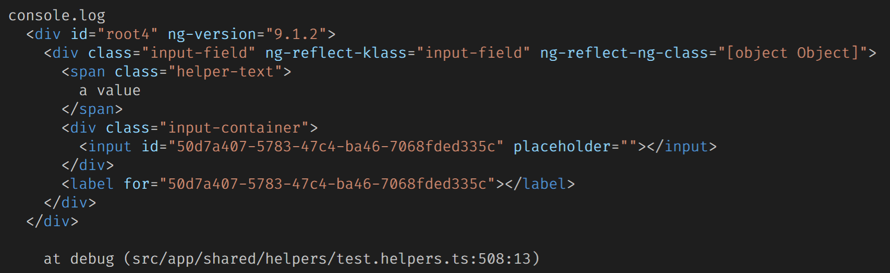

# ngtx

`ngtx` stands for "A**ng**ular **T**esting E**x**tensions" and is a small set of functions aiming to make your life easier when testing Angular components. It's supposed to make your tests lean while increasing the readability by boosting the semantics of each test case.

## Why?

All common things we do in Angular tests are quite verbose. We often find ourselves writing stuff that does not express our intensions, but really just are steps on our way to our test-goal. We think the Angular testing world should be a bit different.

## How?

`ngtx` "injects" helper functionality into your test-suites that can then be used. To enable them you need to:

1.  wrap your test-suite callback in a `ngtx` call
2.  import the helpers you want to use
3.  call `useFixture(fixture)` in the `beforeEach` hook, after the fixture has been created:

---

```ts
import { ngtx } from 'ngtx';

describe(
  'MyTestSuite',
  ngtx(({ useFixture }) => {
    // other stuff ...
    beforeEach(() => {
      fixture = TestBed.createComponent(MyComponent);
      component = fixture.componentInstance;
      useFixture(fixture);
    });

    it('should work like this', () => {
      // ngtx helpers are initialized!
    });
  }),
);
```

---

## Quick Examples

The following examples are just a random collection of tests, demonstrating how `ngtx` of this package might help you in common test-scenarios. Please keep in mind that the following test-cases are acutally testing different components and come from multiple, unrelated test-suites. They are put here together for the sake of brevity. In a real application they must remain in separated test-suites with their own `TestBed`s and `fixtures`, of course.

```ts
import { ngtx, asBool, toNativeElement } from 'ngtx';

const DIALOG_CANCEL = 'Cancel';

describe(
  'Some random tests as basic examples',
  ngtx(({ useFixture, detectChanges, find, findWhere, triggerEvent, attr, textContent }) => {
    let component: AnyComponent;
    let fixture: ComponentFixture<AnyComponent>;

    beforeEach(async(() => {
      TestBed.configureTestingModule({
        /* ... */
      }).compileComponents();
    }));

    beforeEach(() => {
      fixture = TestBed.createComponent(AnyComponent);
      component = fixture.componentInstance;
      useFixture(fixture);
    });

    it('[Wizard] should emit the finish-event when clicking on cancel button', () => {
      // arrange
      spyOn(component.finish, 'emit');

      // act
      const finishButton = findWhere(
        (button) => textContent(button).includes(DIALOG_CANCEL),
        ['.btn-footer-primary', '.btn-footer-secondary'],
        toNativeElement,
      );

      finishButton.click();

      // assert
      const userAction: WizardResult = 'canceled';
      expect(component.finish.emit).toHaveBeenCalledTimes(1);
      expect(component.finish.emit).toHaveBeenCalledWith(userAction);
    });

    it('[TabsComponent] should set label translation to true', () => {
      // arrange
      const { componentInstance: wizard } = find(WizardComponent);

      // act, assert
      expect(wizard.translateTabs).toBe(true);
    });

    it('[Dialog] should emit closeDialog event on finish wizard', () => {
      // arrange
      spyOn(component.closeDialog, 'emit');

      // act
      triggerEvent('finishWizard', WizardComponent);

      // asserrt
      expect(component.closeDialog.emit).toHaveBeenCalledTimes(1);
    });

    it('[Textfield] should pass the readonly attribute', () => {
      // arrange
      const expectedValue = true;

      // pre-condition
      expect(attr('readOnly', 'input', asBool)).not.toBe(expectedValue);

      // act
      component.readonly = expectedValue;
      detectChanges();

      // assert
      expect(attr('readOnly', 'input', asBool)).toBe(expectedValue);
    });

    it('[SomeView] should show a drop down with the currently selected item', () => {
      // arrange
      const expectedValue = 'selected item';
      component.selectedItem = expectedValue;

      // act
      // passing "component" to "detectChanges"
      // additionally runs ngOnInit and ngOnChanges
      // on component, if they are defined:
      detectChanges(component);

      // assert
      expect(textContent('.drop-down-label')).toEqual(expectedValue);
    });
  }),
);
```

# Detailed Documentation

## Quick and Easy Change Detection

Save the `fixture.`-prefix and simply write what you want to say:

```ts
describe(
  'MyTestSuite',
  ngtx(({ useFixture, detectChanges }) => {
    // ...

    it('should save you some key strokes to detect changes', () => {
      // arrange
      component.someProp = 42;

      // act
      detectChanges();

      // assert
      expect(component.someProp).toBe(42);
    });
  }),
);
```

A small bonus: Sometimes you need to have your LifeCycleHooks being run before the change-detection is done. In that case simply pass your component as an argument:

```ts
// runs ngOnChanges and ngOnInit life-cycle-hooks (if defined) on component and then detectChanges:
detectChanges(component);
```

---

## Finding Relevant Elements Easier

Often in Angular tests we need to find elements, we want to inspect further. With Angular this is quite verbose, as there are two major search strategies, that needs to be imported first (`By.css` and `By.directive` from `@angular/platform-browser`).

Also, the returned `DebugElement`'s types are impractical for most use cases, as both, its `componentInstance` and `nativeElement` is of type `any`.

With this package you simply write down your query, and get your types for free, since all these helpers return a `TypedDebugElement`, which is an improved version of Angular's untyped `DebugElement`:

### 1. **Find**-Helper

Searches an element either by CSS or a ComponentType and returns the first match.

> The `debugElement.query(...)`-equivalent.

```ts
describe(
  'MyTestSuite',
  ngtx(({ useFixture, find }) => {
    // ...

    it('should find my elements easily by css and directive', () => {
      // arrange, act
      const debugElement1 = find('button.active');
      const debugElement2 = find(MyComponent);

      // assert
      expect(debugElement1).toBeDefined();
      expect(debugElement2).toBeDefined();
    });

    it('should get practical types', () => {
      // nativeElement is now of type HTMLElement per default:
      const { nativeElement } = find('button.active');

      // nativeElement is of type HTMLInputElement here:
      const { nativeElement } = find<HTMLInputElement>('.my-input');

      // componentInstance is now of type MyComponent
      const { componentInstance } = find(MyComponent);
    });
  }),
);
```

---

### 2. **FindAll**-Helper

Searches elements by either CSS or ComponentType and returns all matching elements.

> The `debugElement.queryAll`-equivalent.

```ts
describe(
  'MyTestSuite',
  ngtx(({ useFixture, findAll }) => {
    // ...

    it('should find my elements easily by css and directive', () => {
      // arrange, act
      const debugElements1 = findAll('button.active');
      const debugElements2 = findAll(MyComponent);

      // assert
      expect(Array.isArray(debugElements1)).toBe(true);
      expect(Array.isArray(debugElements2)).toBe(true);
    });
  }),
);
```

Sometimes it's necessary to execute multiple queries to get all relevant elements for your current test. In these cases you can use `findAll` with multiple queries:

```ts
const allButtons = findAll(['.button-secondary', '.button-primary']);
```

If you need them as `nativeElement`s, you can make use of the second parameter, which accepts a conversion function:

```ts
// import pre-built function
import { toNativeElements } from 'ngtx';

// or define it yourself:
function toNativeElements(input: DebugElement[]): Element[] {
  return input.map((debugElem) => debugElem.nativeElement);
}

// allButtons is now of type Element[]:
const allButtons = findAll(['.button-secondary', '.button-primary'], toNativeElements);
```

---

### 3. **FindWhere**-Helper

`FindWhere` helps you with finding a specific element among a list of relevant elements. It returns the first matching element.

```ts
describe(
  'MyTestSuite',
  ngtx(({ useFixture, findWhere }) => {
    // ...

    it('should find the button with text "OK"', () => {
      // arrange, act
      const okButton = findWhere(
        (candiate) => candiate.nativeElement.textContent === 'OK',
        '.dialog-button',
      );

      // assert
      expect(okButton.nativeElement.textContent).toEqual('OK');
    });
  }),
);
```

---

## Easier Triggering of Events

Triggering an event in Angular is quite easy. But there are a few points that could be improved. The first thing is, that you need to pass an event-args argument, even if no one is needed:

`debugElement.triggerEventHandler('click', undefined);`

It's not a big deal, but doing it over and over again makes you feel like "this should be fixed". Another (also really small) point is that, the name could be a bit shorter. Renaming it to `triggerEvent` would not change the semantics of the method too much, and any developer would still understand what this function is doing.

The last, a bit more major, thing about event triggering in Angular is, that in order to do that, you need to gather the `debugElement` of the element your want to trigger the event. Wouldn't it be nice to leave out the query and just say:

> **"Hey Angular, trigger event XY on component Z, please!"**
>
> or:
>
> **"Hey Angular, find an element matching >css-selector< and trigger the event XY on it."**

With this package, you finally can:

```ts
describe(
  'MyTestSuite',
  ngtx(({ useFixture, triggerEvent }) => {
    // ...

    it('should find the button with text "OK"', () => {
      // arrange
      spyOn(component.myEvent, 'emit');

      // without event args:
      triggerEvent('myEvent', MyComponent);
      // with event args 42:
      triggerEvent('myEvent', '.some-css-selector', 42);

      // works as well:
      const debugElem = find('button');
      triggerEvent('myEvent', debugElem);
      triggerEvent('myEvent', debugElem.nativeElement);

      // assert
      expect(component.myEvent.emit).toHaveBeenCalledTimes(4);
      expect(component.myEvent.emit).toHaveBeenCalledWith(42);
    });
  }),
);
```

When passing in a `ComponentType` or a CSS-selector, `triggerEvent` will run a query and trigger the event on the first, matching element.

---

## Easy Attribute Retrieval

In Angular it can easily become confusing when you are about to test the existence or values of attributes on elements. E.g. Angular distinguishes between `attributes` and `properties`. Also sometimes you'll need to prefix your attribute's name with `"html"`, in order to get the desired result.

To make things easier for you, this package introduce a new `attr`-helper function, which uses the native `getAttribute()` function under the hood. This helps keeping consistent and predictable results for intuitive inputs.

```ts
describe(
  'MyTestSuite',
  ngtx(({ useFixture, attr }) => {
    // ...

    // old-school:
    it('should find the attribute "for" on a label', () => {
      // arrange
      const input = fixture.debugElement.query(By.css('input'));
      const label = fixture.debugElement.query(By.css('label'));

      // act, assert
      expect(label.properties.htmlFor).toEqual(input.properties.id);
    });

    // becomes now:
    it('should find the attribute "for" on a label', () => {
      // arrange, act, assert
      expect(attr('for', 'label')).toEqual(attr('id', 'input'));
    });
  }),
);
```

In cases you want to work with the values of an attribute, you'll need to know that the result of `attr` is always a string per default. This way, a boolean value will be the string `"true"` as a result. If you want to cast or parse the attribute's value-string, you can make use of the optional, third parameter of `attr`, which accepts a conversion function:

```ts
import { asBool, asNumber /* ... */ } from 'angular-test-helpers';

expect(attr('disabled', 'button', asBool)).toBe(true);
expect(attr('counter', 'button', asNumber)).toBe(42);

// it can also be useful for parsing the value-string:
const obj = attr('data-json-string', '.my-item', JSON.parse);
```

---

## Easier Access to Element's Text Content

In order to get the text content of an element, you'll need to gather its `debugElement` first, to have then access to the `debugElement.nativeElement` in order to finally read the `nativeElement.textContent` property. To shortcut this, you can use `textContent`-helper function:

```ts
describe(
  'MyTestSuite',
  ngtx(({ useFixture, textContent }) => {
    // ...

    it('should return the text content of an element', () => {
      // arrange
      const content1 = textContent('button.active');
      const content2 = textContent(TabItem);

      const debugElem = find(TabHeaderItem);
      const content3 = textContent(debugElem);
      const content4 = textContent(debugElem.nativeElement);

      // act, assert
      expect(content1).toEqual('text of button.active');
      expect(content2).toEqual('text of TabItem');
      expect(content3).toEqual('text of TabHeaderItem');
      expect(content4).toEqual('text of TabHeaderItem');
    });
  }),
);
```

---

## HTML Output Debugging

We all know it. Sometimes you're lost with a failing test case and don't even know what's happening there. In these cases it's often helpful to see the actual HTML, rendered by the test case. But there's no easy way to print out the HTML tree to the console.

Now there is. With `debug` you can print the HTML-tree that your test case produces right into your console. Currently the nodes' `tagName`, `class`-attribute and `textContent` is supported for printing.

```ts
describe(
  'MyTestSuite',
  ngtx(({ useFixture, debug }) => {
    // ...

    it('should help you find the bugs in your tests', () => {
      // arrange, act, assert, doesn't work:
      expect(textContent('input.my-input')).toEqual(component.text);

      // debug to the help:
      debug('.input-container');

      /*
          prints to console:

          <div class="input-container active">
            <input class="my-input" value="some text" />
          </div>

          We now may realize that there is no textContent of course,
          as our targeted element is an input, which rather has a
          value property, we need to query.
      */
    });
  }),
);
```

> Real screenshot:
>
> 

## Core Team

- Julian Lang (GitHub: JulianLang, author of `ngtx`)

