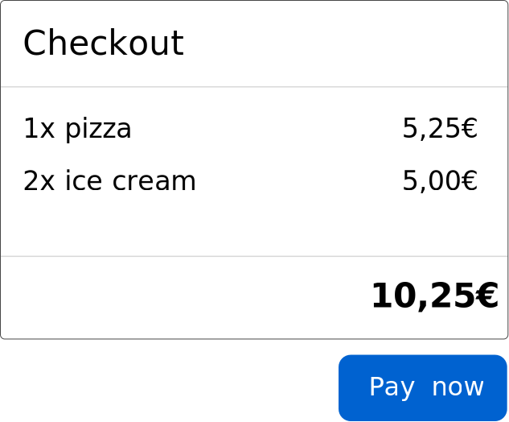

[docs]: ./ngtx.md
[home]: ../README.md

## [🏠][home] &nbsp; → &nbsp; [Documentation][docs] &nbsp; → &nbsp;**Custom Extension-Functions**

> #### 💡 New to ngtx?
>
> If you're new to ngtx and don't know the basic concepts yet, better
> [start here first][docs]!

## Extending ngtx' Declarative Api

ngtx comes with several neat `predicates` and `assertions` but there will probably be (quite a lot of) cases where you need to add custom logic in order to make your test suit fit your needs. ngtx' api is designed with extendability in mind. Let's jump it.

### Custom Predicates: CartView Example

Let's say we have a cart-view where a user gets listed what they are about to purchase. In Angular we would use a `CartService` to provide the cart-data. When testing this view, we may want to set the state of the mocked version of the `CartService`, so that we are in control about what items will be handed to the view.

> ### The Result
>
> 

Unfortunately ngtx does not provide something like that out of the box, but we can help ourselves and create such a predicate extension. Let's start with a draft, how we would like to use our extension later in our tests:

```ts
it('should render all cart items', () => {
  When(host)
    .has(
      // the predicate-extension we are about to build:
      providerWithState(CartService, {
        cartItems: [
          { name: 'pizza', price: 5.25 },
          { name: 'ice cream', price: 2.5 },
        ],
      }),
    )
    .expect(the.CartItems)
    .to(beFound({ times: 2 }));
});
```

Ok, looks decent enough to go to the next step: the implementation.
The first thing we have to do is to define the function and its parameter-list:

```ts
const providerWithState = (token: any, stateDef: any) => {
  // yet to come
};

// or - with better type support:
const providerWithState = <T, S extends T>(token: T, stateDef: Partial<S>) => {
  // yet to come
};
```

> ### Please Note
>
> While the second example is the one with better intellisense, we're going with the first one in this example for the sake of brevity and readability. In real applications, you should consider choosing the second way.

In the next step we need to import and use ngtx' `createExtension` function. This function hands us some tools and information we are going to need to describe and pass our logic to ngtx:

```ts
import { createExtension } from '@centigrade/ngtx';

const providerWithState = (token: any, stateDef: any) => {
  return createExtension((getTargets, { addPredicate }, fixture) => {
    // yet to come
  });
};
```

In the code above we imported the `createExtension` function and declare all the helper we're going to use soon.
Let's go through the parameters that we are provided with by `createExtension`:

- `getTargets`: When calling this function, we get an array-like list of the _targets_ that is defined by the user in the test:

  `... .expect(host).to(haveStyle(...))`: in this example calling `getTargets` will return us a list with only the resolved `host` reference in it. The resolved reference is of type `NgtxElement` a small wrapper around Angular's built-in `DebugElement`. It provides some extra features, but we're not taking a close look to them right now.

- `addPredicate`: this helper allows you to schedule predicate-logic to the current test. Your predicate-logic will be called in the order they appear within a test and before all assertions will execute.

- `fixture`: this is a reference to the `NgtxFixture`. Again, this type is a small wrapper around Angular's built-in `ComponentFixture`. It also adds some extra functionality and we also will ignore the details for now.

Now that we know what these helper can do for us, we can pass our predicate-logic to ngtx:

```ts
import { createExtension } from '@centigrade/ngtx';

const providerWithState = (serviceClass: any, stateDef: any) => {
  return createExtension((getTargets, { addPredicate }, fixture) => {
    addPredicate(() => {
      // get the targets that the user defined in the test
      const targets = getTargets();
      // now we run our logic on all targets that were found:
      for (const target of targets) {
        // get the service instance from the target:
        const service = target.injector.get(serviceClass);
        // go through the stateDef and assign it to the service instance:
        for (const propNameAndValue of Object.entries(stateDef)) {
          const propName = propNameAndValue[0];
          const value = propNameAndValue[1];
          service[propName] = value;
        }
      }
      // now that we updated the service on all targets, we should detect changes:
      fixture.detectChanges();
    });
  });
};
```

Oh, that's quite a lot. Let's go through it to better understand what's going on:

- first we call `addPredicate` and pass it an arrow-function. This is the place where we pass ngtx our custom logic and tell that this should be a predicate. This information is important for ngtx to know _when_ the logic should be executed (before assertions).
- next we utilize the first parameter `getTargets` to retrieve the targets that the user defined in the test. Examples:

  ```ts
  // target is "host" (= the component under test):
  When(host).has(providerWithState(/*...*/));
  // targets are the CartItemComponents:
  const theCartItems = () => getAll(CartItemComponent);
  When(theCartItems).has(providerWithState(/*...*/));
  // target is a native button element
  // (which would not make too much sense for this type of predicate):
  const theCancelButton = () => get('button.cancel');
  When(theCancelButton).has(providerWithState(/*...*/));
  ```

  > The key finding here is, that the target is always the expression that was passed to the `When`-function (or `and`-function for subsequent, chained expressions):
  > `When(host).has(state({...})).and(theCancelButton).gets(clicked())`
  >
  > - target 1: host (state gets set there)
  > - target 2: theCancelButton (emits a click-event)

- After retrieving the target(s), we run our predicate-logic on each target. All targets provide their injector reference, that we use to inject the desired service-instance from the target.
- In the next step we run through all properties on the given, desired service-state and assign those properties to the service.
- in the very end, after assigning all state to the service, we run Angular's change-detection by utilizing the `fixture`-parameter.

That's it! Now we can use our predicate like we drafted in the beginning:

```ts
import { providerWithState } from './my-ngtx-extensions';
import { CartService } from './services/cart.service';

// ...
it('should render all cart items', () => {
  When(host)
    .has(
      // the predicate-extension we are about to build:
      providerWithState(CartService, {
        cartItems: [
          { name: 'pizza', price: 5.25 },
          { name: 'ice cream', price: 2.5 },
        ],
      }),
    )
    .expect(the.CartItems)
    .to(beFound({ times: 2 }));
});
```

### Custom Assertions: Expander-Example

Imagine we have a `ExpanderComponent` with an arrow-icon inside. Whenever the expander is opened, the arrow-icon should get a style-css property "`transform: rotate(180deg)`". However, if the expander is closed the transform gets reset to zero.

You created this component and it works great:

```html
<section class="title">
  <app-icon
    name="arrow-down"
    [style.transform]="opened ? 'rotate(180deg)' : 'rotate(0deg)'"
  ></app-icon>
</section>

<section *ngIf="opened" class="contents">
  <ng-content></ng-content>
</section>
```

> ### The Result
>
> 
>
> Clicking it will expand the expander and rotate the arrow icon:
>
> 

Now we want to test the rotation behavior of the arrow. After looking into the built-in assertions list, we realize - ngtx does not provide a way to assert styles being applied to an element. Bummer!

But fortunately, we can help ourselves. We just need to create a custom assertion. Let's start with the _vision_ of our extension - how do we want to use it later? What about this:

```ts
it('should rotate the arrow icon when opened', () => {
  // hint: host = component under test = ExpanderComponent
  When(host)
    .has(state({ opened: true }))
    .expect(the.ArrowIcon)
    // here we use our desired extension, that we are going to build:
    .to(haveStyle('transform', 'rotate(180deg)'));
});
```

Looks great! Now let's implement it; we start with defining the extension function's name and parameter list:

```ts
export const haveStyle = (styleProp: string, expectedValue: string) => {};
```

That's easy. Next we create the implementation. In order to do this we need to use ngtx' `createExtension`-function. This function takes a function and marks it as extension for ngtx. There is a reason for that, but let's not bother for now:

```ts
import { createExtension } from '@centigrade/ngtx';

export const haveStyle = (styleProp: string, expectedValue: string) => {
  return createExtension(() => {
    // yet to come ...
  });
};
```

The `createExtension`-function hands us some tools and information about the current test, that we can use to inject our logic. To use them we just declare them on our argument list:

```ts
import { createExtension } from '@centigrade/ngtx';

export const haveStyle = (styleProp: string, expectedValue: string) => {
  return createExtension(
    (getTargets, { addAssertion, isAssertionNegated }, fixture) => {
      // yet to come ...
    },
  );
};
```

Let's go through the parameters that we are provided with by `createExtension`:

- `getTargets`: When calling this function, we get an array-like list of the _targets_ that is defined by the user in the test:

  `... .expect(host).to(haveStyle(...))`: in this example calling `getTargets` will return us a list with only the resolved `host` reference in it. The resolved reference is of type `NgtxElement` a small wrapper around Angular's built-in `DebugElement`. It provides some extra features, but we're not taking a close look to them right now.

- `addAssertion`: this helper allows you to schedule assertion-logic to the current test. Your assertion-logic will be called at the end of the test, after all predicates have been executed.

- `isAssertionNegated`: this bool-flag tells you whether the user called `.not` ahead of your assertion, e.g. `... .expect(host).not.to(haveStyle(...))`. This way you can react to the negation and adapt your assertion-logic as needed.

- `fixture`: this is a reference to the `NgtxFixture`. Again, this type is a small wrapper around Angular's built-in `ComponentFixture`. It also adds some extra functionality and we also will ignore the details for now.

Now that we know about all the arguments we are given, we can finally use them to add our assertion-logic:

```ts
import { createExtension } from '@centigrade/ngtx';

export const haveStyle = (styleProp: string, expectedValue: string) => {
  return createExtension(
    (getTargets, { addAssertion, isAssertionNegated }, fixture) => {
      // step 1: pass ngtx our assertion function:
      addAssertion(() => {
        // step 2: get all targets to run our assertion-logic on:
        const targets = getTargets();

        // step 3: run the assertion-logic on every target:
        targets.forEach((target) => {
          // retrieve the HTMLElement's style object:
          const styles = target.nativeElement.styles;
          // check if the defined style-property has the expected value:
          // "styleProp" and "expectedValue" comes from our defined parameters (line 3)
          const actualValue = styles[styleProp];
          expect(actualValue).toEqual(expectedValue);
        });
      });
    },
  );
};
```

Cool! But wait. We ignore the fact, that `isAssertionNegated` could be true. In this case, we need to alter our logic a bit. Let's quickly fix that:

```ts
import { createExtension } from '@centigrade/ngtx';

export const haveStyle = (styleProp: string, expectedValue: string) => {
  return createExtension(
    (getTargets, { addAssertion, isAssertionNegated }, fixture) => {
      addAssertion(() => {
        const targets = getTargets();

        targets.forEach((target) => {
          const styles = target.nativeElement.styles;
          const actualValue = styles[styleProp];

          // fix: check for isAssertionNegated and adapt logic:
          if (isAssertionNegated) {
            expect(actualValue).not.toEqual(expectedValue);
          } else {
            expect(actualValue).toEqual(expectedValue);
          }
        });
      });
    },
  );
};
```

That's it! With this extension written, we can actually use it in our test as we drafted out earlier:

```ts
import { haveStyle } from './my-ngtx-extensions';

// ...
it('should rotate the arrow icon when opened', () => {
  When(host)
    .has(state({ opened: true }))
    .expect(the.ArrowIcon)
    .to(haveStyle('transform', 'rotate(180deg)'));
});
```

and we can even use it with `.not`:

```ts
import { haveStyle } from './my-ngtx-extensions';

// ...
it('should rotate the arrow icon when opened', () => {
  When(host)
    .has(state({ opened: false }))
    .expect(the.ArrowIcon)
    .not.to(haveStyle('transform', 'rotate(180deg)'));
});
```

<!-- TODO: also explain how to use type-constraints to make extensions available for a specific TargetRef-type -->
