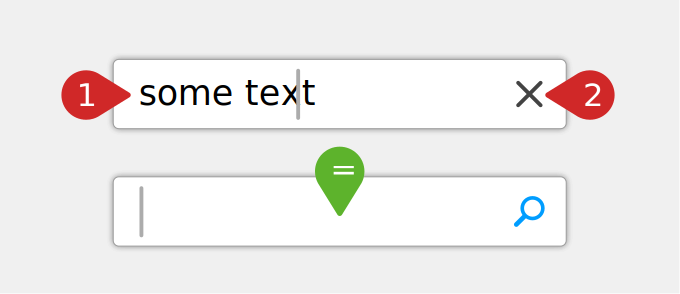

[home]: ../README.md
[overview]: ./overview.md
[addngtx]: ./add-ngtx.md
[builtins]: ./built-in.md
[extensionfns]: ./extending.md

# [🏠][home] &nbsp; → &nbsp; [Documentation][overview] &nbsp; → &nbsp; **Getting Started**

## Understanding Testing as ngtx Sees It

Testing in ngtx is based on a simple concept stating that certain trigger(s) will cause certain effect(s), which we then can observe and assert.

If you know the [AAA-unit test pattern](https://robertmarshall.dev/blog/arrange-act-and-assert-pattern-the-three-as-of-unit-testing/) (arrange, act, assert), **conditions** are what you would put into the `// arrange` block of your AAA-unit test, **triggers** are what you would put into the `// act` block, and the expected **effect** then represents the `// assert` part of your unit test.

Exactly as in **AAA tests**, the first two parts can sometimes be empty.

ngtx sees an Angular unit test only as **an arbitrary number of conditions, followed by one or more triggers, that we _expect_ to cause a certain effect**. Using the before mentioned example:

- When the button is disabled (condition)
- and we click on it (trigger),
- we expect that no event handler was called (effect).

With ngtx we can put all **conditions**, **triggers** and expected **effects** in one readable sentence. Let's take a look at this example _(explanation follows, so don't mind if you don't get everything)_:

> ### Visual representation of our test scenario:
>
> "when the textbox' text is not empty and the user clicks the clear button, the textbox' text should be cleared".
>
> 

```ts
it('[the clear button] should clear the textbox when enabled', () => {
  // arrange: set properties on host (host = component under test)
  When(host)
    .has(state({ disableClear: false, text: 'some text' }))
    // act: click the clear button in host's html-template
    .and(the.ClearButton)
    .gets(clicked())
    // assert: that host's text got cleared
    .expect(host)
    .to(haveState({ text: '' }));
});

it('[the clear button] should not clear the textbox when disabled', () => {
  // arrange: set properties on host to disable clear-button
  When(host)
    .has(state({ disableClear: true, text: 'some text' }))
    // act: click disabled clear button
    .and(the.ClearButton)
    .gets(clicked())
    // assert: that text didn't get cleared
    .expect(host)
    .to(haveState({ text: 'some text' }));
});
```

> 💡 `host` always references the component under test, which is - in this case - a custom Angular `TextboxComponent`.

### Explanation of the First Example-Test

While most of the test-"sentence" seems to be kind of magic, we will begin to understand the different parts in just a minute. For now we can see, that the first test's sentence consists of two **triggers** causing a single **effect** that we check for:

- **Trigger 1:** the textbox-component ("`host`") gets its `text`-property set to the string `"some text"`, and its `disableClear` property to `false`
- **Trigger 2:** the `ClearButton` gets clicked,
- **Expected effect:** the textbox' `text` property is reset to an empty string (`""`)

## Getting Slightly More In-Depth

In a more formal way, a ngtx test looks like this:

```
When(<target>)
   .does/has/is/gets(<something>)
 [ .and(<target>).does/has/is/gets(<something>) ]*
   .expect(<target>)
   .to(<effect>)
```

> where each `<target>` can be in fact a different element or sub-component of the component-under-test's html template.

This means that we always start with a `When`-function to define the first trigger and then (optionally) chain an arbitrary number of additional triggers via adding `and`s. In the end, we then check for a certain effect.

But what the heck are "`<target>`s", "`<something>`s" and "`<effect>`s"? Let's see.

### TargetRefs ("`<target>`s")

Let's see some examples on how to define targets for ngtx, before going into explanations:

```ts
// hint: we will learn about the "get" helper later on.
// for now: it retrieves an element or component from the template
// of the component under test (aka "host")
const theUsernameField = () => get(TextboxComponent);
const theLoginButton = () => get<HTMLButtonElement>('.btn[type=submit]');
// then use it where targets are accepted:
When(theUserNameField).does(/*...*/).expect(theLoginButton).to(/*...*/);
```

#### Explanation

A `<target>` refers a function without any arguments, returning a reference to a specific html-element or child-component of the component-under-tests' template. ngtx resolves those **targets** automatically when running your test-cases. So:

- `theUsernameField`: when called, retrieves the first component in the template, being an instance of `TextboxComponent`
- `theLoginButton`: when called, retrieves the first html-element in the template, matching the given css-selector

### Predicates ("`<something>`")

Again, let's start with some examples, and then explain them:

```ts
// "clicked" is a predicate, that emits a click-event on a target:
When(the.Button).gets(clicked());
// "state" is a predicate, that sets properties
// on a target's componentInstance:
When(host).has(state({ disabled: true }));
// "attributes" is a predicate, that sets properties
// on a target's nativeElement:
When(the.Button).has(attributes({ disabled: true }));
```

A predicate is a function that executes an operation on a given **target**. A test case can contain an arbitrary number of predicates that will be executed in the order they appear. Please note that you can also [write your own predicates][extensionfns], if there is a use case that is not covered by the built-in predicates.

> See all built-in predicates and assertions in the [list of built-in features][builtins].

### Assertions ("`<effect>`")

An assertion is a function that runs a certain check on a given **target**. A test case can contain an arbitrary number of assertions that will be executed in the order they appear. If one of the checks fail, the whole test will fail, too. Please note that you can also [write your own assertions][extensionfns], if there is a use case that is not covered by the built-in assertions.

> See all built-in predicates and assertions in the [list of built-in features][builtins].

## Revisit: Importing ngtx to Your Tests

In earlier examples we saw the usage of a mysteriously present `When`-function or the `state`-predicate. But where do these things come from? We skipped some code in order to leave out a bit of boilerplate. But now is the right time to draw the whole picture.

[👉 Let's see the whole test-code, extending the example-test.][addngtx]
