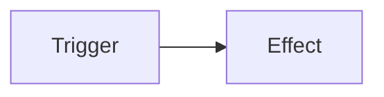

[home]: ../README.md
[overview]: ./overview.md
[addngtx]: ./add-ngtx.md
[extensionfns]: ./extending.md

# [🏠][home] &nbsp; → &nbsp; [Documentation][overview] &nbsp; → &nbsp; **Getting Started**

## Understanding Testing as ngtx Sees it

Testing in ngtx is based on a simple concept stating that certain trigger(s) will cause certain effect(s), which we, in turn, can observe.



&nbsp;

An Angular unit test – seen from this perspective – is only **a chain of certain triggers**, that we _expect_ to cause a certain effect. With ngtx we can describe this relation of triggers and effects in a human readable way. Let's take a look at this example:

```ts
it('[the clear button] should clear the content of the textbox', () => {
  // trigger 1:
  When(host)
    .has(state({ text: 'hi!' }))
    // trigger 2:
    .and(the.ClearButton)
    .gets(clicked())
    // effect:
    .expect(host)
    .to(haveState({ text: '' }));
});
```

> 💡 `host` always references the component under test, which is - in this case - a custom Angular `TextboxComponent`.

**Just ignore the fact that we didn't import e.g. the `When` function or `state` anywhere in the example. We will learn this in the very end of this article.**

While most of the test-"sentence" seems to be kind of magic, we will begin to understand the different parts in just a minute. For now we can see, that the sentence consists of two `triggers` causing a single `effect` that we check for:

- **Trigger 1:** the textbox-component ("`host`") gets its `text`-property set to the string `"hi!"`,
- **Trigger 2:** the ClearButton gets clicked,
- **Expected effect:** the textbox' text property got reset to an empty string (`""`)

In slightly other words:

> "when the textbox' text is not empty and the user clicks the clear button, the textbox' text should be cleared".
>
> 

## The Details

In a more formal way, a ngtx test looks like that:

```
When(<subject>)
   .does/has/is/gets(<something>)
 [ .and(<subject>).does/has/is/gets(<something>) ]*
   .expect(<object>)
   .to(<effect>)
```

This means that we always start with a `When`-function to define the first trigger and then – optionally – chain an arbitrary number of additional triggers after that. In the end, we then check for a certain effect.

Okay, that makes somewhat sense. But what the heck are "`<subject>`s", "`<something>`s" and "`<effect>`s"? Let me explain.

### TargetRefs ("`<subject>`s")

> 🚨 What we called "`<subject>`s" earlier in the example is better referred to as _"Targets"_, to not confuse them with the widely known `rxjs`-subjects.

A `TargetRef` is a simple function, returning a handle to a specific part of the component-under-tests' template (**_"Target"_**). ngtx needs to call those `TargetRef`s to find your _target(s)_ when actually running your test-case.

Here are some examples, how to create target-refs:

```ts
// hint: we will learn later about the "get" helper and how to import it:
const theUsernameField = () => get(TextboxComponent);
const theLoginButton = () => get<HTMLButtonElement>('.btn[type=submit]');
// then use it where targets are accepted:
When(theUserNameField)
  .does(/*something*/)
  .expect(theLoginButton)
  .to(/*haveDoneSomething*/);
```

- `theUsernameField`: when called, retrieves the first element in the template being an instance of `TextboxComponent`
- `theLoginButton`: when called, retrieves the first element in the template matching the given css-selector

### Predicates ("`<something>`")

A predicate is a function that executes an operation on a given _target_. A test case can contain an arbitrary number of predicates that will be executed in the order they appear. Please note that you can also [write your own predicates][extensionfns], if there is a use case that is not covered by the built-in predicates.

> See all built-in predicates and assertions in the [overview][overview].

### Assertions ("`<effect>`")

An assertion is a function that runs checks on a given _target_. A test case can contain an arbitrary number of assertions that will be executed in the order they appear. If one of the checks fail, the test case will fail, too. Please note that you can also [write your own assertions][extensionfns], if there is a use case that is not covered by the built-in assertions.

> See all built-in predicates and assertions in the [overview][overview].

## Revisit: Importing ngtx to Your Tests

In earlier examples we saw the usage of a mysteriously present `When`-function or the `state`-predicate. But where do those things come from? We skipped some code, to not bother you with some small boilerplate. But now is the right time to draw the whole picture.

[👉 Let's see the whole test-code, extending the example-test.][addngtx]
