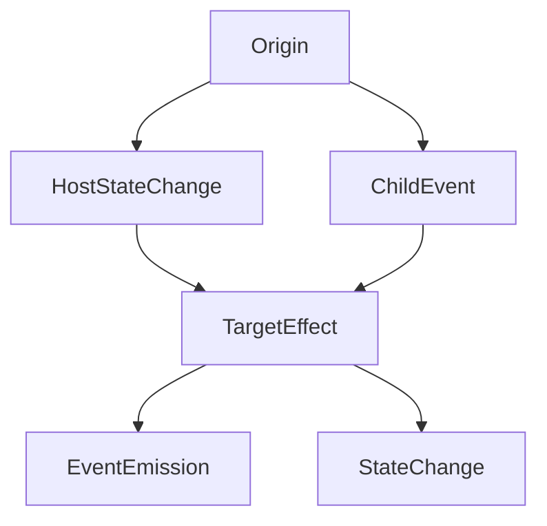
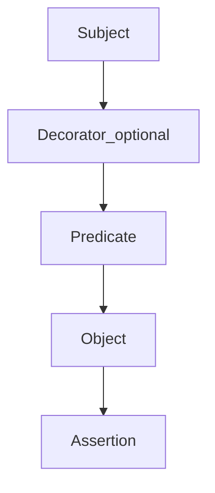

# Effect Api

API that allows to write tests in a more meta like manner that declaratively describes behavior rather than imperatively doing it with statements.





## Scheme

```ts
When(subject).predicate().expect(object).assertion(params);
```

### Example

```ts
import { $event } from 'ngtx';

class the {
  static Input() {
    return get<HTMLInputElement>('input');
  }
  static Button() {
    ...
  }
}

let When = createApi(useFixture(fixture), jest.fn);

When(the.Input) // subject
  .emits('change', 'args') // predicate
  .expect('host') // object
  .toHaveState({ text: $event }); // assertion

When(the.Input) // subject
  .emits('change', 'args') // predicate
  .expect('host') // object
  .toEmit('textChange', { text: $event }); // assertion

When(the.Button) // subject
  .getsClicked() // predicate
  .expect(the.Input) // object
  .withSpy('focus') // object override
  .toHaveBeenCalled({ times: 2 }); // assertion

When(the.Button) // subject
  .getsClicked() // predicate
  .expect(the.Input) // object
  .withSpy('focus') // object override
  .toHaveBeenCalled()
  .times(2)
  .try(); // assertion
```

## With multiple objects:

```ts
When(host) //
  .hasState({ width: '300px' })
  .expect(Container.Items)
  .toHaveState([{ items: [1, 2, 3] }, { items: [4, 5, 6] }]);
```
